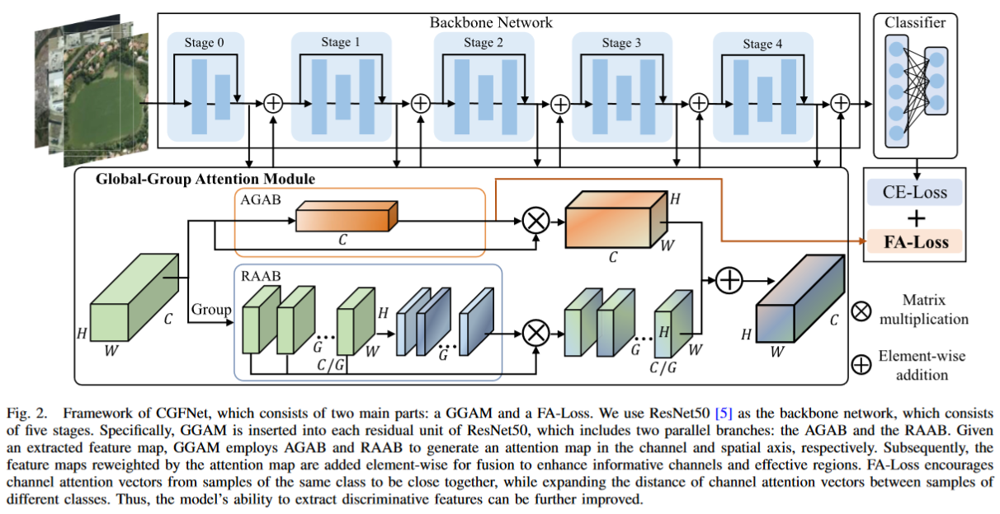

# CGFNet

This is the implementation of CGFNet ([Global-Group Attention Network With Focal Attention Loss for Aerial Scene Classification](https://ieeexplore.ieee.org/document/10356044)). 

### Getting Started
1. Please prepare the dataset for aerial image classification and put it in path " data_root = r'./datasets/' " of file main\.py
2. Determine the parameters in file main\.py, and run command "python main\.py"
>
     @article{zhao2023global,
        title={Global-Group Attention Network With Focal Attention Loss for Aerial Scene Classification},
        author={Zhao, Yichen and Chen, Yaxiong and Rong, Yi and Xiong, Shengwu and Lu, Xiaoqiang},
        journal={IEEE Transactions on Geoscience and Remote Sensing},
        year={2023},
        publisher={IEEE}
    }
